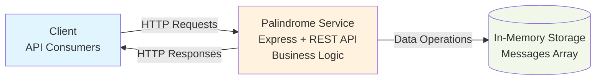

# Palindrome Service

A RESTful API service for managing and analyzing palindrome messages. Built with Express.js following Test-Driven Development (TDD) principles and clean architecture patterns.

## Features

- The service provides full CRUD operations to create, read, update, and delete messages
- Palindrome detection runs automatically in all requests
- Messages can be filtered by palindrome status using query parameters (`isPalindrome=true/false`)
- The API follows RESTful design principles
- The codebase includes 19 comprehensive test cases covering integration and unit testing
- In-memory storage provides fast, demo-ready data persistence

## Architecture Overview

This service follows a layered architecture pattern with clear separation of concerns:

- The Express Router layer handles HTTP request processing and routing logic
- The Service layer contains business logic and data operations through the MessageService class
- The Utility layer provides core palindrome detection functionality
- The Test layer ensures comprehensive coverage with an organized test structure

### Technology Stack

- Node.js with modern ES6 module syntax
- Express.js 5.x
- Testing with Mocha with Supertest and Chai
- Nodemon for automatic server reloading
- Express routers for organization

### Architecture Diagram



## Project Structure

```
palindrome-service/
├── src/                         
│   ├── index.js                # Main application setup
│   ├── routes/                 # Express route handlers
│   │   ├── messages.js         # Message CRUD endpoints
│   │   └── health.js           # Health check endpoint
│   ├── services/               # Business logic layer
│   │   └── messageService.js   
│   └── palindrome.js           # Palindrome detection utility
├── test/                       # Test files
│   ├── api/                    # API endpoint tests
│   │   ├── post-messages.test.js
│   │   ├── get-messages.test.js
│   │   ├── put-messages.test.js
│   │   ├── delete-messages.test.js
│   │   └── integration.test.js
│   ├── health.test.js          # Health endpoint tests
│   └── palindrome.test.js      # Palindrome logic tests
├── package.json                
└── README.md                   
```

## Getting Started

### Prerequisites

- Node.js (v18+ recommended)

### Installation

1. Clone the repository:
```bash
git clone <repository-url>
cd palindrome-service
```

2. Install dependencies:
```bash
npm install
```

3. Verify installation:
```bash
npm test
```

## Running the Application

### Available Scripts

```bash
npm start          # Start production server
npm run dev        # Start development server with auto-reload
npm test           # Run all tests
npm test:watch     # Run tests in watch mode
npm run coverage   # Run tests with coverage report
```


### Development Mode
Start the server with auto-reload on file changes:
```bash
npm run dev
```

### Production Mode
Start the server normally:
```bash
npm start
```

### Configuration
- **Default Port**: 3000
- **Environment Variable**: Set `PORT` to customize
- **Example**: `PORT=8080 npm start`

The service will be available at `http://localhost:3000`

## API Documentation

### Base URL
```
http://localhost:3000
```

### Health Check
**GET** `/health`

Returns service status information.

**Response:**
```json
{
  "status": "OK",
  "timestamp": "2025-08-09T10:30:00.000Z",
  "service": "palindrome-service"
}
```

### Messages Endpoints

#### Create Message
**POST** `/messages`

**Request Body:**
```json
{
  "content": "racecar"
}
```

**Response:** `201 Created`
```json
{
  "id": 1,
  "content": "racecar",
  "isPalindrome": true,
  "createdAt": "2025-08-09T10:30:00.000Z",
  "updatedAt": "2025-08-09T10:30:00.000Z"
}
```

#### Get All Messages
**GET** `/messages`

**Query Parameters:**
- `isPalindrome` (optional): `true` | `false` - Filter messages by palindrome status

**Examples:**
```bash
# Get all messages
GET /messages

# Get only palindromes
GET /messages?isPalindrome=true

# Get only non-palindromes  
GET /messages?isPalindrome=false
```

**Response:** `200 OK`
```json
[
  {
    "id": 1,
    "content": "racecar",
    "isPalindrome": true,
    "createdAt": "2025-08-09T10:30:00.000Z",
    "updatedAt": "2025-08-09T10:30:00.000Z"
  }
]
```

#### Get Message by ID
**GET** `/messages/:id`

**Response:** `200 OK` (same as create response)

#### Update Message
**PUT** `/messages/:id`

**Request Body:**
```json
{
  "content": "hello world"
}
```

**Response:** `200 OK` (updated message object)

#### Delete Message
**DELETE** `/messages/:id`

**Response:** `200 OK` (deleted message object)

### Error Responses

**400 Bad Request:**
```json
{
  "error": "Message content must be a non-empty string"
}
```

**404 Not Found:**
```json
{
  "error": "Message not found"
}
```

## Testing

### Run All Tests
```bash
npm test
```

### Test Coverage
```bash
npm run coverage
```

Generate test coverage reports:
- Detailed coverage at `coverage/index.html`
- Current coverage: 95.25% overall with 100% function coverage

### Test Structure
- The test suite includes 19 comprehensive tests covering all functionality
- Unit tests verify palindrome detection logic with various edge cases
- Integration tests validate complete CRUD workflows end-to-end
- API endpoint tests are organized by HTTP method for maintainability

